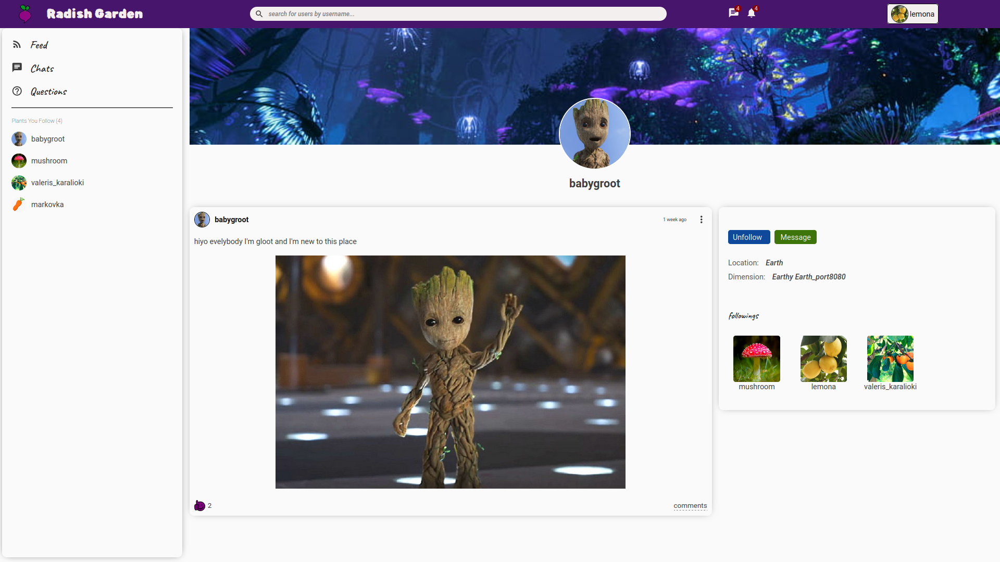

# Radish Garden Media Corp. [Link](https://client-zk8et.ondigitalocean.app/)

#####  Repository directories are added as submodules that hold references of source code. 


### About 

**Radish Garden** is my full-stack project which is a social media platform for plants across the globe. :earth_asia: :seedling:
By the way plants have better network _(WoodWideWeb)_ but anyways I gave it a try. **Plants are awesome.** They deserve social media on the internet.  

[visit](https://client-zk8et.ondigitalocean.app/)  **Radish Garden**, explore and make plant friends. 

_some keys to navigate easily_
* Create new account
* Or log in with already exiting account which will make it easy to navigate
```
  Email:     lemon@lemon
  Password:  lemonLemon0808
```


## Features and stack 

### Features

* Unique username creation (email & password)
* Server side authentication
* Searching all users by username
* Users activity monitoring
* User session recording (online users)
* follow/unfollow users
* add/edit/delete posts
* like/unlike posts
* add/delete/update comments/nested comments
* create conversations
* send/unsend messages

*User profile customization* 
* change/update username
* change/update password
* update/delete avatar picture
* update/delete banner picture
* update/delete user info components (aboutMe/location/dimension)


### Stack

###### Client Side
* React 
* React Router @6
* Material UI
    * Material UI/core
    * Material UI/icons
* CSS

###### Server Side
* NodeJS
  * express.js
* MongoDB 
  * Mongoose
  * GridFSBucket
* Multer
  * multer-gridfs-storage
* Bcrypt
* Socket.io


###### Hosting service
 * Digital Ocean
   * App Platform 
  
## Challenges

There is no doubt that I've learned a lot while building and experimenting with this project. Although, some features I initially intended to implement
are not yet implemented I encountered lots of code-structuring and designing related challenges which made me to look at the whole developing process in a different way.
As far as the app is far from ideal solution and some of required functionalities still are in the line to be implemented, surely I'm going to learn more.


#### Database and Data Structure 

I tried to structure the data so that it is saved and retrieved as easily as possible. To do so I've followed MongoDB's data modeling design and came up with the following solution. 


```javascript
// User
{
        "_id": "636d861ee..",
        "profilePicture": "filename/8b69bb38...",
        "coverPicture": "07cb2931e550814d16fa0842e1d8229b",
        "followers": [user_alpha_id, user_beta_id],
        "following": [user_alpha_id, user_beta_id],
        "username": "babygroot",
        "email": "babygroot@babygroot",
        "password": "*************",
        "desc": "I'm gloot and I'm tlee",
        "dimesion": "earthy_earth_port_8080",
        "location": "pandora",
}


// Post
{
        "_id": "636d861ee...",
        "userId": "user_alpha_id",
        "desc": "hiyo evelybody I'm gloot and I'm new to this place",
        "img":"filename/8b69bb38.."
        "likes": [user_alpha_id, user_beta_id],
}

// Conversation
{
        "_id": "81eB4312h...",
        "members": [user_alpha_id, user_beta_id],
}

// Message
{
        "_id": "43yoEb72...",
        "convoId": "81eB4312h..."
        "senderId": "636d861ee..."
        "text": "hello!"
}


// Image
{
        "_id": "43yoEb72...",
        "userId": "636d861ee...",
        "filename": "filename/8b69bb38...",
        "fileId": "21uH14bb...", 
        "originalName": "babygroot.png",
}
```

####  Bidirectional communication 

Providing a low-overhead instant communication channel between the server and the client are what I've never before implemented in the app. 
My main goal was keeping track of user session recordings and also receiving and sending instant messages in the chat-box without reloading the page.


####  File uploading 
Storing files directly into a database through a single API call had intrigued me for quite some time. 
That is where GridFS came into the picture for me. Using MongoDB GridFS and helping multer and multer-gridfs-storage job got done.


